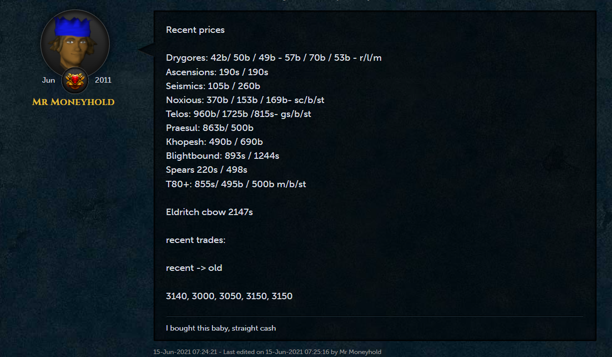
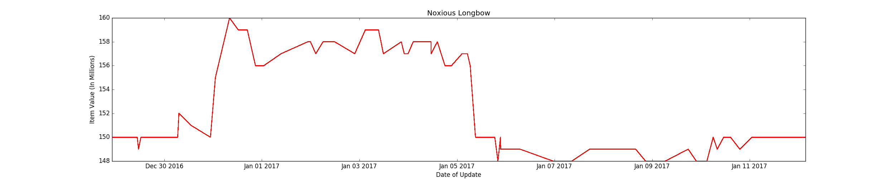

# Rsforums_Prices
Contains a web scraper (written in Python 3) that uses regular expressions to find prices of the format &lt;float/int>/&lt;float/int>/.../&lt;float/int>

-Unfortunately, the Runescape forums have permanently been deleted, so this tool is useless. 

-For historical purposes, here is what the old forums looked like:

-When the forums were alive, this is what it used to output as a result of parsing price reporting on the forums:

